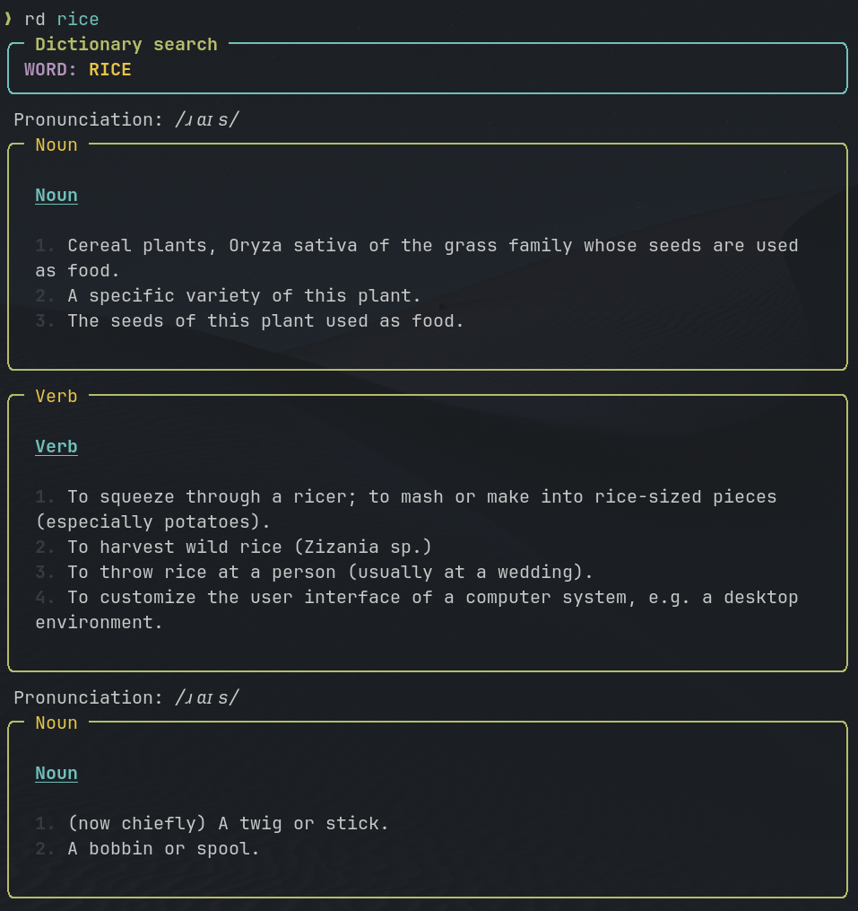

# 📚 rd - Rich Dictionary CLI



This is a fast and robust command-line tool for looking up English definitions directly in the terminal. The application uses the public [Dictionary API](https://dictionaryapi.dev/) for data and leverages the **Typer** and **Rich** libraries to deliver a modern, typed, and visually appealing interface.

Since the application uses synchronous networking, it is stable and avoids common issues with event loop management in packaged environments.

## ✨ Features

  * **Clear Output:** Uses `rich.Panel` to visually separate different parts of speech (nouns, verbs, etc.) and definitions.

  * **Modern CLI:** Built with `typer` for clean argument handling and help messages.

  * **Robust Networking:** Uses `httpx` for reliable synchronous API calls with error handling for network failures and 404 Not Found.

  * **Type-Safe:** The entire codebase is type-annotated (Python 3.10+ syntax) for increased maintainability.

## 🚀 Installation and Running

Assuming Python 3.10+ is available and the environment is set up with `uv` or `pip`:

### 1\. Dependency Installation

Dependencies are best installed and synchronized with the locked environment using `uv sync`:

```
uv sync
```

### 2\. Running the Application

Since the alias **`rd`** is configured as the project's entry point in `pyproject.toml` (e.g., `rd = "rich_dictionary_cli.cli:cli"`), the application runs directly using the alias via `uv run`:

```
uv run rd awesome
```

-----

## 🛠️ Local Testing and Permanent Installation

This section covers how to build the distribution package and test the resulting wheel using `uvx` and how to permanently install the tool using `uv tool install`.

### 1\. Building the Package

First, generate the Python distribution wheel (`.whl`) file. This assumes you are using a tool like `uv` or `hatch` for building:

```bash
uv build
# The output file (e.g., rich_dictionary_cli-0.1.0-py3-none-any.whl) 
# will be placed in the 'dist/' directory.
```

### 2\. Testing the Wheel with `uvx`

We can use the **`uvx`** command (an alias for `uv tool run`) for testing. `uvx` is used to run the command-line tool provided by a Python wheel without explicitly installing the tool into a persistent environment or adding it to the system's PATH.

Use the alias **`rd`** (as defined in `pyproject.toml`) and the path to the built wheel:

```bash
uvx dist/rich_dictionary_cli-0.1.0-py3-none-any.whl rd munificence
```

If successful, the output should look similar to this, confirming the application runs correctly:

```
Installed 8 packages in 75ms
Definitions for 'munificence':
... (rich output)
```

### 3\. Permanent Local Installation

To install the CLI application in a more permanent way on your system, use `uv tool install`:

```bash
uv tool install dist/rich_dictionary_cli-0.1.0-py3-none-any.whl
```

On Linux/macOS, the installation location can be verified using the `which` command. The command will be installed under the alias `rd` (as configured in your `pyproject.toml`):

```bash
$ which rd
~/.local/bin/rd
```

The application can now be run directly from any terminal using the command `rd`.

#### Example

```text
$ rd hamburger
╭─ Dictionary search ──────────────────────────────────────────────╮
│ WORD: HAMBURGER                                                  │
╰──────────────────────────────────────────────────────────────────╯
 Pronunciation: /ˈhæm.bə.ɡə/
╭─ Noun ───────────────────────────────────────────────────────────╮
│                                                                  │
│  Noun                                                            │
│                                                                  │
│  1. A hot sandwich consisting of a patty of cooked ground beef   │
│  or a meat substitute, in a sliced bun, sometimes also           │
│  containing salad vegetables, condiments, or both.               │
│  2. The patty used in such a sandwich.                           │
│  3. Ground beef, especially that intended to be made into        │
│  hamburgers.                                                     │
│  4. (somewhat crude) An animal or human, or the flesh thereof,   │
│  that has been badly injured as a result of an accident or       │
│  conflict.                                                       │
│      Example: "I'm going to make you into hamburger if you do    │
│  that again."                                                    │
│  5. A hamburger button.                                          │
│                                                                  │
╰──────────────────────────────────────────────────────────────────╯
```

### Uninstalling

Uninstall by running

```bash
$ uv tool uninstall rich_dictionary_cli
```

which will give you this message if uninstalled successfully

```text
Uninstalled 1 executable: rd
```
